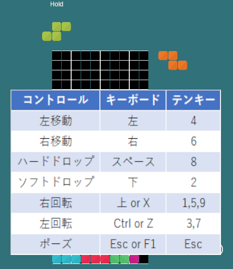
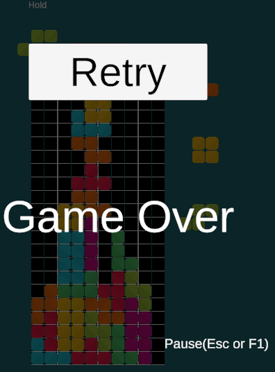

## Unityによるテトリス  
Unity Version 2022.3.17f1  
[UnityPlay](https://play.unity.com/p/webgl-builds-387555/edit)  

  
## 操作  
Pause Escキー F1キー  
左移動 :左　or key4  
右移動 :右　or key6  
右回転 :上 or X or key9,key5,key1  
左回転 :Z or key3,key7  
ハードドロップ：Space or key8  

## 生成  
7種のミノをランダムに生成します  
7 つの異なるテトリミノが仮想バッグに入れられ、ランダムな順序でシャッフルされます。この順序は、バッグが次のキューに「フィード」する順序です。  
バッグが空になると、新しいテトリミノをバッグに入れ、シャッフルしたのちに新たにフィードします。

## ネクスト  
ネクストは３段階まで表示しています。Holdの機能はありません。

## ロックダウンシステム
クラシックロックダウンを採用しています。
同じラインで0.5秒ミノが存在するならばロックダウンします。現在のラインよりも下にさがれば、ロックダウンタイマーはリセットされます。  

## ローテーションシステム  
Tスピンなどの技が使用できる、スーパーローテーションシステムではありません。
クラシックローテーションシステムです。

## 画像
  
  
  

## 参考
[Unity入門に最適な、テトリス講座【Unity】](https://www.youtube.com/watch?v=IbHhV_-8VxQ)  
[Unity 2D でテトリスを制作しました（コードや仕様の公開）](https://fall-and-fall.hatenablog.com/entry/unity/2d/tetris/overview)  
  
Docフォルダに、ガイドラインのPDFがありますので、参考にされてください。  
## 免責事項  
免責事項の受諾:  
本ゲームをプレイすることで、プレイヤーは以下の免責事項に同意したものと見なされます。  
本免責事項は、プレイヤーとゲームの提供者との間で法的な契約を構成します。  
  
免責範囲:  
ゲームの提供者は、本ゲームに関連するいかなる損害、事故、損失、またはその他の問題に対しても一切の責任を負いません。  
プレイヤーは、本ゲームを自己の責任でプレイし、提供者に対して損害賠償を求めないことに同意します。  
  
技術的な問題:  
ゲームの提供者は、技術的な問題、障害、または中断によって引き起こされるプレイヤーの損害に対して責任を負いません。  
これには、ウェブサーバーの障害、通信の遮断、データ損失などが含まれます。  
  
内容の変更:  
ゲームの提供者は、事前の通知なしにゲームの内容や機能を変更する権利を有します。  
変更が行われた場合、提供者はそれに起因する損失や不便に対して責任を負いません。  
  
サードパーティのコンテンツ:  
本ゲームにはサードパーティによるコンテンツやリンクが含まれる可能性があります。  
これらのコンテンツに関連する問題については、サードパーティの規約と条件が適用されます。  

