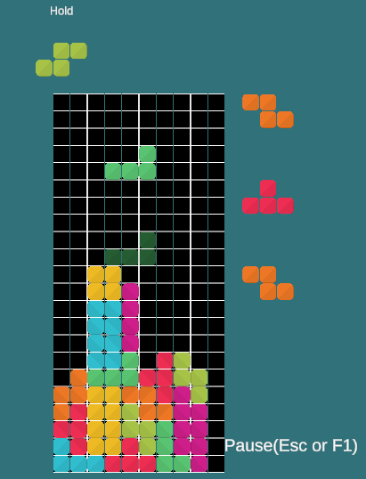

## Unityによるテトリス  
Unity Version 2022.3.17f1

## 操作  
Pause Escキー F1キー  
左移動 :左　or key4  
右移動 :右　or key6  
右回転 :上 or X or key9,key5,key1
左回転 :Z or key3,key7
ハードドロップ：Space or key8

## 生成  
7種のミノをランダムに生成します  
7 つの異なるテトリミノが仮想バッグに入れられ、ランダムな順序でシャッフルされます。この順序は、バッグが次のキューに「フィード」する順序です。  
バッグが空になると、新しいテトリミノをバッグに入れ、シャッフルしたのちに新たにフィードします。

## ネクスト  
ネクストは３段階まで表示しています。Holdの機能はありません。

## ロックダウンシステム
クラシックロックダウンを採用しています。
同じラインで0.5秒ミノが存在するならばロックダウンします。現在のラインよりも下にさがれば、ロックダウンタイマーはリセットされます。  

## 画像
  
  
  

## 参考
[Unity入門に最適な、テトリス講座【Unity】](https://www.youtube.com/watch?v=IbHhV_-8VxQ)  
[Unity 2D でテトリスを制作しました（コードや仕様の公開）](https://fall-and-fall.hatenablog.com/entry/unity/2d/tetris/overview)  
  
Docフォルダに、ガイドラインのPDFがありますので、参考にされてください。
